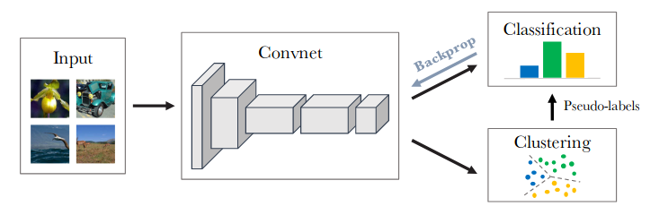
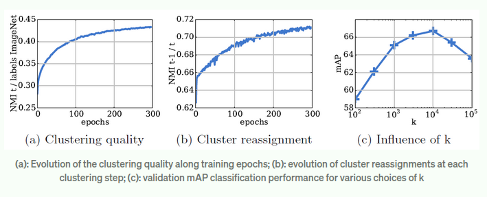
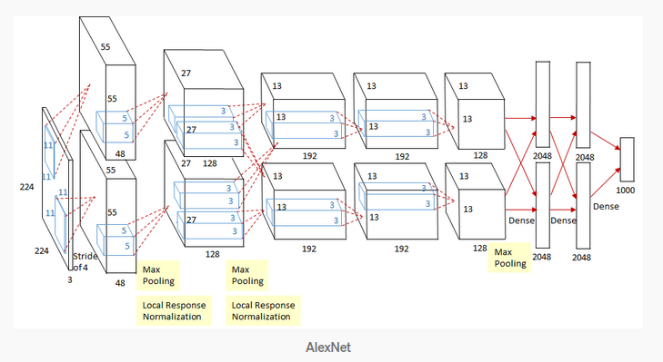

# Deep Clustering for Unsupervised Learning of Visual Features

Pre-trained convolutional neural nets, or covnets produce excelent general-purpose features that can be used to improve the generalization of models learned on a limited amount of data. Moving forward, we are always in search of bigger, better and more diverse datasets, which ould require a tremendous amount of manual annotations, despite the expert knowledge in crowdsourcing  ccumulated by the community over the
years. So, this project attempts to review methods which can be trained on internet-scale datasets, with potentially billions of images with no supervision. 

The implenentation here is largely inspired from [Facebook AI Research paper: Deep Clustering for Unsupervised Learning of Visual Features](https://openaccess.thecvf.com/content_ECCV_2018/papers/Mathilde_Caron_Deep_Clustering_for_ECCV_2018_paper.pdf).

## Literature Review
### Unsupervised Learning of Features
Several methods exist that use unsupervised learning to pre-train covnets, for example:
* Coates and Ng method, uses k-means and learns each layer sequentially going bottom-up. 
* Yang et al., whcih iteratively learns covnet fratures and clustes with a recurrent framework. Although this works wonders on small datasets, it is not scalable to lager ones.
* Bojanowski and Joulin learn visual features on a large dataset, with a loss that attempts to preserve the information flowing through the network. 
* And finally, Caron et al., the approach we follow, uses k-means in an end-to-end fashion.

### Self-supervised Learning
We can use pretext tasks to replace the labels annotated by humans by “pseudo-labels” directly computed from the raw input data.

### Generative Models
Recently, unsupervised learning has been making a lot of progress on image generation. Typically, a parametrized mapping is learned between a predefined random noise and the images, with either an autoencoder, a generative adversarial network (GAN) or more directly with a reconstruction loss.

## Our Approach
In this implementation we cluster the output of the covnet and use the subsequent cluster assignment as "pseudo-labels" to optimise the equation:

where, 
*  is a training set of N images
*   is a parameter such that the mapping  produces a good general-purpose set of features.
*  is a parameterized classifier which predicts the correct labels on top of the features 
*  is multinomial logistic loss.

The deep clustering approach iteratively learns the features and groups them. Here, we used k-means, which takes in a set of vectors as input, here, the set of features output by the covnet and clusters them into k distinct groups based on a geometric criterion. That is, it jointly learns a  centroid matrix C and cluster the assignments  of each image  by solving the problem:

such that 

Overall, we alternate between clustering to produce pseudo-labels (second equation) and updating the params of the covnet by predicting these pseudo-labels (first equation).

### Avoiding Trivial Errors

#### Empty Clusters
* An optimal decision boundary is to assign all of the inputs to a single cluster. This issue is caused by the absence of mechanisms to prevent from empty clusters.
* More precisely, when a cluster becomes empty, a non-empty cluster is randomly selected and its centroid is used with a small random perturbation as the new centroid for the empty cluster. The points are then reassigned belonging to the non-empty cluster to the two resulting clusters.
#### Trivial Parameterization
* If the vast majority of images is assigned to a few clusters, the parameters θ will exclusively discriminate between them.
* A strategy to circumvent this issue is to sample images based on a uniform distribution over the classes, or pseudo-labels.

## Visualisations

## Analysis

### Normalized Mutual Information (NMI)
NMI calculates the performance as a ratio of the mutual information and the square-root of the entropy. If, say, the two assignments are independent, NMI comes out as 0, and if theu are deterministically predictable from each other, it is equal to 1. 

* (a): The dependence between the clusters and the labels increases over time, showing that the learnt features progressively capture information related to object classes.
* (b): The NMI is increasing, meaning that there are less and less reassignments and the clusters are stabilizing over time.
* (c): The best performance is obtained with k= 10,000. Given that ImageNet has 1000 classes. Apparently some amount of over-segmentation is beneficial.

We implemented the AlexNet model (8 convolutional layers) with deepcluster, trained on the ImageNet. The difference of performance between DeepCluster and a supervised AlexNet grows significantly on higher layers: at layers conv2-conv3 the difference is only around 4%, but this difference rises to 12.3% at conv5, marking where the AlexNet probably stores most of the class level information.

AlexNet is a state of the art method of image classification, but requires a lot of memory for implementation. At the moment of its introduction, NVIDIA GTX 580 GPU is used which only got 3GB of memory. Thus, we can see in the architecture that they split into two paths and use 2 GPUs for convolutions. Inter-communications are only occurred at one specific convolutional layer. The use of 2 GPUs is to manage the memory problem and not to speed up the process.

## Conclusion and Further Study

If trained on large dataset
like ImageNet, the proposed scalable clustering approach achieves performance that are better than the previous state-of-the-art on every standard transfer task. 

One of the major issues with the process is that k-mean clustering takes plenty of time. If we were to find a more optimized method for clustering, it is possible to make the process more efficient. Since k-means is yet the simplest clustering algorithms yet known, this is something that can be explored in the domain of Unsupervised Machine Learning.

## References
* [Facebook AI Research: Caron, Bajanowski, Joulin and Douze; Deep Clustering for Unsupervised Learning of Visual Features](https://openaccess.thecvf.com/content_ECCV_2018/papers/Mathilde_Caron_Deep_Clustering_for_ECCV_2018_paper.pdf)
* Bottou, L.: Stochastic gradient descent tricks. In: Neural networks: Tricks of the trade, pp. 421–436. Springer (2012)
* Huang, F.J., Boureau, Y.L., LeCun, Y., et al.: Unsupervised learning of invariant feature hierarchies with applications to object recognition. In: CVPR (2007)
* [ Image Colorization With Deep Learning and Classification](https://cs.stanford.edu/people/karpathy/deepvideo/)
* Bojanowski, P., Joulin, A.: Unsupervised learning by predicting noise. ICML (2017)
* Yang, J., Parikh, D., Batra, D.: Joint unsupervised learning of deep representations
and image clusters. In: CVPR (2016)